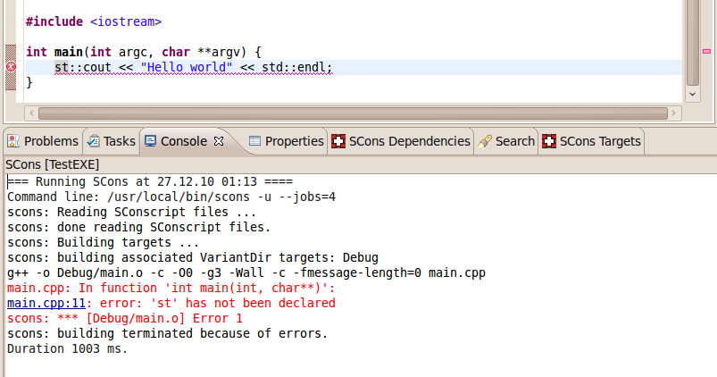

SConsolidator - An Eclipse plug-in for SCons
============================================

### Install it from our Eclipse Update Site at http://www.sconsolidator.com/update

## Introduction

SCons is an open source software build tool which tries to fix the 
numerous weaknesses of Make clones like the missing automatic
dependency extraction, the complex syntax to describe build 
properties and the cross-platform issues when using shell scripts. 
SCons is a self-contained tool which is not dependent on any existing
platform utilities. Because it is based on Python the user has the 
full power of a modern scripting language to deal with all build 
related issues.

For the acceptance of a build tool it is very important to have a 
comfortable integration into an IDE. Before now there was no 
satisfying support for SCons in Eclipse. SConsolidator - a term project
at the University of Applied Sciences in Rapperswil - addresses this 
and provides tool integration for SCons in Eclipse for a convenient 
C/C++ development experience.

## Features

- Convertion of existing CDT managed build projects to SCons projects
- Import of existing SCons projects into Eclipse with wizard support
- Interactive mode to quickly build single C/C++ source files speeding up round-trip times
- A special view for a convenient build target management of all workspace projects
- Graph visualization of build dependencies that helps in debugging SCons build problems

## Documentation

See this [getting started guide](http://sconsolidator.com/projects/sconsolidator/wiki/Getting_Started) for help on how to use SConsolidator with your C++ projects.

## Contribution help

### Minimum requirements to contribute

- Java 7
- Eclipse 3.7 (Indigo)
- SCons
- Maven v3 (because we use Tycho)

### Eclipse project setup

- Install Eclipse and SCons
- Import projects into Eclipse with the project wizard
- Open target file `ch.hsr.ifs.sconsolidator.core.target` and install dependencies
  through "Set as Target Platform"

### Build

We use Tycho and Maven to build the project artifacts:

$ mvn compile

### Run tests

$ mvn integration-test

or if you prefer to run the tests in a X screen buffer, you can use the following script:

$ runtests.sh

### Project layout

#### ch.hsr.ifs.sconsolidator.core
SConsoldator's core functionality including all UI stuff, project wizards, builders,
Python files for collection build information from existing projects, etc.

#### ch.hsr.ifs.sconsolidator.core.tests
All Junit tests for SConsolidator's core functionality as well as the tests for
collecting build information from existing projects

#### ch.hsr.ifs.sconsolidator.feature
Eclipse feature project for SConsolidator's core plug-in

#### ch.hsr.ifs.sconsolidator.depviz
SConsolidators dependency visualization plug-in that shows the dependencies between
C++ build entities like source, object and library files; based on the Eclipse's
Visualization Toolkit Zest

#### ch.hsr.ifs.sconsolidator.depviz.feature
Eclipse feature project for SConsolidator's dependency visualization plug-in

#### ch.hsr.ifs.sconsolidator.help
Eclipse project for SConsolidator's Eclipse help system (Getting started guide,
welcome page, etc.)

#### ch.hsr.ifs.sconsolidator.swtbottests
Some UI tests based on SWTBot

#### ch.hsr.ifs.sconsolidator.updates
Eclipse Update site project
